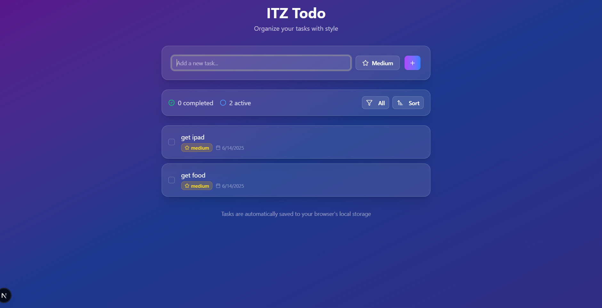

# 📝 ITZ Todo

**Organize your tasks with style** — A sleek, modern to-do list built with **React + Next.js**, featuring filtering, sorting, priority management, and localStorage persistence.

---

## 🚀 Features

- ✅ Add, complete, and delete tasks
- 🔄 Filters: All, Active, Completed
- 📊 Sorting: Newest, Oldest, Alphabetical, Priority
- ⭐ Priority selection: High, Medium, Low
- 💾 Auto-save to browser localStorage
- ✨ Fully responsive with elegant UI (Glassmorphic)

---

## 📸 Screenshot

> UI preview — your tasks are automatically saved to the browser.



---

## 🧪 Testing Guidance

### 📦 Setup

1. **Clone the repo:**
   ```bash
   git clone https://github.com/itzDeepansu/assignment-2
   cd assignment-2
   ```

2. **Install dependencies:**
   ```bash
   npm install
   ```

3. **Run the app:**
   ```bash
   npm run dev
   ```

4. **Open http://localhost:3000 in your browser.**

### ✅ Manual Test Checklist

#### 🔹 Task Input & Validation
- [ ] Add a task (e.g. "Buy milk") — it should appear in the list
- [ ] Try adding empty input — should prevent submission
- [ ] Choose priority (defaults to Medium)

#### 🔹 Task Actions
- [ ] Mark a task complete by checking the checkbox
- [ ] Unmark it by unchecking
- [ ] Click clear selected to clear all completed tasks
- [ ] Click trash icon to delete selected task

#### 🔹 Filters
- [ ] **All** – shows all tasks
- [ ] **Active** – shows only incomplete tasks
- [ ] **Completed** – shows only completed tasks

#### 🔹 Sorting
- [ ] **Newest First** – most recently added tasks at the top
- [ ] **Oldest First** – oldest tasks at the top
- [ ] **Alphabetical** – sorted A-Z by task name
- [ ] **Priority Based** – sorted by: High → Medium → Low

#### 🔹 LocalStorage
- [ ] Refresh the page — tasks should persist
- [ ] Modify tasks status and check that state is saved between sessions

---

## 🛠️ Tech Stack

- **Framework:** Next.js
- **Language:** TypeScript
- **UI:** TailwindCSS + ShadCN + custom design (Glassmorphism)
- **State:** React State
- **Storage:** localStorage (for persistence)

---

## 🎯 Getting Started

After following the setup instructions above, you can start using ITZ Todo immediately. The application will automatically save your tasks to your browser's local storage, so your data persists between sessions.

## 📝 Usage Tips

- Tasks are automatically saved as you create, modify status , or delete them
- Use the priority system to organize your most important tasks
- Combine filters and sorting options to view your tasks exactly how you want
- The responsive design works great on both desktop and mobile devices
